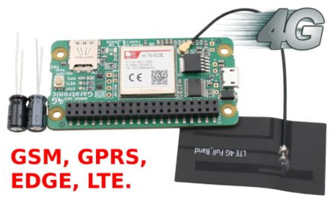
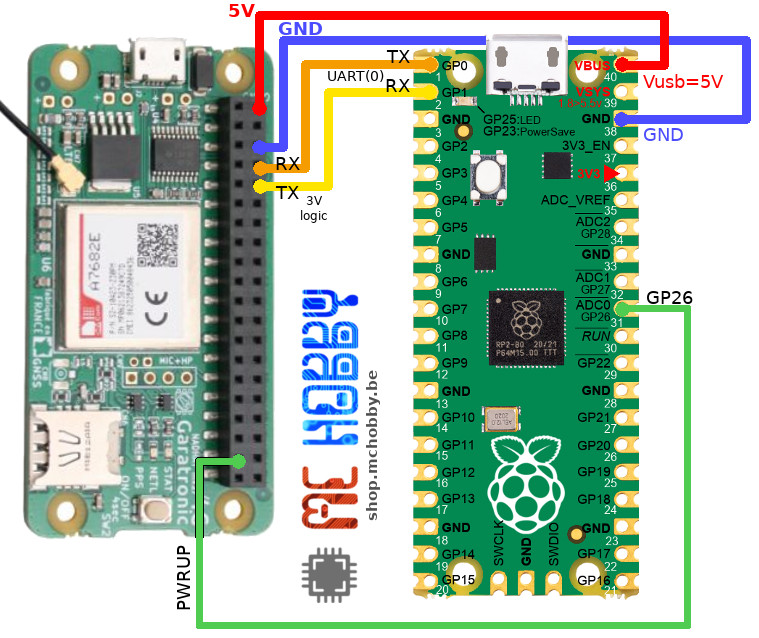

# SIMCom A7682E Modem library

MicroPython SIM76xx module based on the work [SIM7600 MicroPython Library](https://github.com/basanovase/sim7600) from basanovase.

The MicroPython library was tested and consolidated around the "[SimCom A7682E Nadhat GSM MK2 - 4G / LTE - USB et HAT](https://shop.mchobby.be/fr/hats-et-phats/2515-nadhat-gsm-mk2-4g-lte-usb-et-hat-simcom-a7682e-3232100025158-garatronic.html)" available at MCHobby and developped by [Garatronic France](https://blog.garatronic.fr/index.php/fr/).



The SimCom A7682E HAT offers great support for Raspberry-Pi nano computer either via GPIO, either via the USB interface (see microUSB connector). This __HAT can also be used with microcontrolers__ and we selected a Raspberry-Pi Pico running under MicroPython.

__The URC Hell__: the challennge of any modem alike library is to deal with URC (Unsollicited Result code)! URC are messages spontaneously sent by the modem to the host (microcontroler) to get informed about unespected event. The difficulty here is that URC may appears in a middle of a command response (command initiated by the host) OR when when the microcontroler code doesn't interact with the modem. 

The library covers:

* Connecting network,
* SMS,
* calling, 
* phonebook, _<pending>_
* GPRS, _<pending>_
* FTP, _<pending>_
* TCP/IP and HTTP _<pending>_

## Credit 

Based on the work [SIM7600 MicroPython Library](https://github.com/basanovase/sim7600) from basanovasewhere.

# Library


The library must be copied on the MicroPython board before using the examples.
Please note that LIBRARIAN must also be installed.

On a WiFi capable plateform:

```
>>> import mip
>>> mip.install("github:mchobby/micropython-A7682E-modem")
>>> mip.install("github:mchobby/esp8266-upy/LIBRARIAN")

```

Or via the mpremote utility :

```
mpremote mip install github:mchobby/micropython-A7682E-modem
mpremote mip install github:mchobby/esp8266-upy/LIBRARIAN
```

# Wiring

## Wiring to Pico



# Known issues

__SMS__

* Send message is sensitive to concurrent URC reception (Unsolicitated Result Code). That may occasionaly raise an exception due to response parsing issue.

# Connecting the mobile Network

The most critical part of any mobile project is to be able to __establish a stable connection with the Mobile Network__.


## SIM Card
Before anything else, you must have a SIM Card. 

__If it is a new one then place it into a Cell Phone and make a first phone call__ to properly activates the line and the services (eg: this is usually required here in Belgium).

Most of SIM card requires a PIN code. The library do properly handles it.

## Configure hardware interface

The interface required is:

* an UART (8N1 @ 115200) to communicates with the SIMCom A4682E.
* a digital pin to control the POWER signal/button (to starts the SIMCom module).

The following lines creates the required ressource (on a Pico) in a Python script

``` python
from machine import UART, Pin
from sim76xx import *
import time

pwr = Pin( Pin.board.GP26, Pin.OUT, value=False )
uart = UART( 0, tx=Pin.board.GP0, rx=Pin.board.GP1, baudrate=115200, bits=8, parity=None, stop=1, timeout=500)
```
## Power up and register a mobile network

Next, we do create an instance of the SIM76XX class by mentionning the UART and power 

``` python
sim = SIM76XX( uart=uart, pwr_pin=pwr, uart_training=True, pincode="6778" )
```

* __uart_training__ : this parameter is a remainder of old SIMCom modules configured with auto-baud detection. That option sends several AT command to help the SIMCom module to detect baudrate. _I'm not sure this option is really useful with the AT7682E.
* __pincode__ : the PIN required to unlock the SIM card. None can be used if the SIM card is not PIN code protected.


The next operation will start power up the module (if required) and initialize the SIMCom mocule (as appropriate).

``` python
sim.power_up()
```

Call the `power_up()` execute the following steps:

1. Purge the serial RX line.
2. Check if the module is already UP and Running (which may happen at hot start/at host microcontroler restarts). In such case, the module will respond to a single AT command ;-)
3. __IF__ the module is down __THEN__ the power pin is toggle for 1 sec AND the code waits 10 seconds for the module to starts. It also performs the UART training if required + purge the serial RX line.
4. Deactivate the ECHO mode
5. Check if PIN code is required to unlock the SIM card. If so then the pincode is sent to the module.

__Remark:__ the `power_up()` execution will take at least 15 sec at cold start. At hot start, the module is already initialized then the `power_up()` takes less than a second.


Once the PIN code entered, the module will starts mobile network search and registration.

The following line will wait for module to get registered on the network. It is very important because no service (SMS, voice call, etc) could be made before a registration on a mobile network. 

As the module may cycle between "Not searching", "Searching new operator" and a registration (Home Network/Roaming/SMS only), the code will wait up to 5 minutes after power_up() to get the network registration. Outside that time frame, a "not searching" state will raise an exception. Notice that some other registration status may immediately raise exception (eg: denied rehistration)

``` python
while not sim.is_registered:
	time.sleep(1)
```

__Remark:__ at hot start, the `is_registered()` with return a positive feedback if the module is already registered.

## Summary

Here a summary code for module startup.

``` python
from machine import UART, Pin
from sim76xx import *
import time

# Pico 
pwr = Pin( Pin.board.GP26, Pin.OUT, value=False )
uart = UART( 0, tx=Pin.board.GP0, rx=Pin.board.GP1, baudrate=115200, bits=8, parity=None, stop=1, timeout=500)
sim = SIM76XX( uart=uart, pwr_pin=pwr, uart_training=True, pincode="6778" )

sim.power_up()
while not sim.is_registered:
	time.sleep(1)
```

# Catching URC

The URC (Unsollicited Result code) are proprely catched when executing commands issued by the microcontroler. The URC are autoamtically stored into the __notifications__ queue.

The queue can contains up to 20 lasts notifications, older ones are pushed-out from the __notifications__ queue when not handled by the user code.

When user script is not executing commands (SMS/Voice/etc), the user script can capture/pump the newer URC events by calling the `update()` method.

It is the responsability of the user script to pump events out of the __notifications__ queue by calling the `pop()` method. 

The [test_notifs.py](examples/fundamentals/test_notifs.py) script shows how call the `update()` then how to pump out the notifications with `pop()`.

``` python
from machine import UART, Pin
from sim76xx import *
import time

pwr = Pin( Pin.board.GP26, Pin.OUT, value=False )
# Pico 
uart = UART( 0, tx=Pin.board.GP0, rx=Pin.board.GP1, baudrate=115200, bits=8, parity=None, stop=1, timeout=500)
sim = SIM76XX( uart=uart, pwr_pin=pwr, uart_training=True, pincode="6778" )
sim.power_up()
while not sim.is_registered:
	time.sleep(1)

print( 'Waiting for incoming messages' )
while True:

	sim.update()
	if sim.notifs.has_new:
		print( "%i notifications availables" % len(sim.notifs) )
		notif = sim.notifs.pop()
		while notif._time != None:
			print( notif ) # tuples (_time, _type, source, cargo)
			notif = sim.notifs.pop()

	time.sleep(1)
```

Which produce the following the messages in the REPL session:

``` bash
Waiting for incoming messages
2 notifications availables
Notif(_time=1609520178, _type=2, source='RING', cargo=None)
Notif(_time=1609520178, _type=1, source='+CLCC: 1,1,4,0,0,"+33359260058",145', cargo=CallState(call_id=1, dir=1, state=4, mode=0, mpty=False, number='+33359260058', ntype=145))
1 notifications availables
Notif(_time=1609520185, _type=2, source='RING', cargo=None)
3 notifications availables
Notif(_time=1609520189, _type=2, source='VOICE CALL: END', cargo=None)
Notif(_time=1609520189, _type=2, source='NO CARRIER', cargo=None)
Notif(_time=1609520189, _type=1, source='+CLCC: 1,1,6,0,0,"+33359260058",145', cargo=CallState(call_id=1, dir=1, state=6, mode=0, mpty=False, number='+33359260058', ntype=145))

```

The `pop()` method return a namedtuple with data  about the notification.

* ___time__ : simply the time.time() when the notification was received.
* ___type__ : indicates the type of notification. See the constants UNDEFINED (0), CURRENT_CALL (1), VOICE (2), SMS (3) as declared in [core.py](lib/sim76xx/core.py):Notifications class.
* ___source__ : source text of the notification
* __cargo__ : may contains an object with detailled notification information.

``` python
UNDEFINED    = const(0)
CURRENT_CALL = const(1) # Notification +CLCC: with caller phone number
VOICE        = const(2) # RING, NO CARRIER, ... old style of voice call notificiation
SMS          = const(3) # +CMTI: "SM",3 ... SMS mem,id notification 
```

## CURRENT_CALL unsolicited result code
__When__ the `_type` equal Notifications.CURRENT_CALL __then__ the cargo contains a `CallState` namedtuple with additional information:

* __call_id__ : identification of the call
* __dir__ : direction of the call. See constant `Notifications.DIR_xxx`.
* __state__ : current state of the call. See constant `Notifications.CALLSTATE_xxx`. 
* __mode__ : call mode. see constant `Notifications.MODE_xxx`. 
* __pty__ : Multiparty call (True/False)
* __number__ : the phone number (or None when unknown)
* __ntype__ : numbering type. See constantes `Notifications.NTYPE_xxx`.

The constant values are defined in the `Notifications` class (see the excerpt below coming from [core.py](lib/sim76xx/core.py) file for full details).


``` python
# --- CallState constants ----------------------
DIR_OUTGOING = const(0)
DIR_INCOMING = const(0)

CALLSTATE_ACTIVE   = const(0)
CALLSTATE_HELD     = const(1)
CALLSTATE_DIALING  = const(2) # Outgoing call 
CALLSTATE_ALERTING = const(3) # Outgoing call
CALLSTATE_INCOMING = const(4)
CALLSTATE_WAITING  = const(5)
CALLSTATE_DISCONNECTED = const(6)

MODE_VOICE  = const(0)
MODE_DATA   = const(1)
MODE_FAX    = const(2)
MODE_UNKNOW = const(9)

NTYPE_RESTRICTED    = const(128) # Restricted number (includes unknown type and format)
NTYPE_INTERNATIONAL = const(145)
NTYPE_NATIONAL      = const(161)
NTYPE_SPECIFIC      = const(177) # Network specific number (eg:ISDN format)
NTYPE_OTHER         = const(129)
```

# Testing
Reading the examples is a going starting point to understand how the library works.

## fundamentals examples

* __[test_initial.py](examples/fundamentals/test_initial.py)__ : [VERY IMPORTANT] power up the module, check if pincode is required (and enter it), wait the SIMCom to register the network.
* __[test_control.py](examples/fundamentals/test_control.py)__ : test the 'control' sub-library (get IMEI, network access, Network Scan, RSSI, SIM serial, ....)
* __[test_notifs.py](examples/fundamentals/test_notifs.py)__ : how to use the 'update()' call to capture the URC Unsollicitated Result Code (like SMS received, RING, ...)
* __[test_pwroff.py](examples/fundamentals/test_pwroff.py)__ : soft shutdown/power_off the module with AT command
* __[test_raw.py](examples/fundamentals/test_raw.py)__ : very basic examples. The first used to test the communication with SIMCom module

## SMS examples

* __[test_delete_all.py](examples/sms/test_delete_all.py)__ : [VERY IMPORTANT] delete all the messages stored in the SIM and make room to received new SMS from the mobile network.
* __[test_delete.py](examples/sms/test_delete.py)__ : delete a stored SMS by it ID, useful to freeup the SIM memory when the SMS was received and read.
* __[test_list.py](examples/sms/test_list.py)__ : list the SMS ID for the statuses RECEIVED_UNREAD, RECEIVED_READ, UNSENT, SENT, ALL.
* __[test_read.py](examples/sms/test_read.py)__ : read a stored SMS by its ID.
* __[test_read_all.py](examples/sms/test_read_all.py)__ : list ALL IDs of the stored SMS and read the corresponding messages.
* __[test_send.py](examples/sms/test_send.py)__ : send SMS message to a phone number.
* __[test_on_notif_read.py](examples/sms/test_on_notif_read.py)__ : [VERY IMPORTANT] wait SMS notification from mobile network then read it and send a confirmation.

## Voice call examples
* __[test_call.py](examples/voice/test_call.py)__ : Make a call  to a number, then drop it after 10 secs of talk. Do also detects when the recipient hang-up the call.
* __[test_answer.py](examples/voice/test_answer.py)__ : Wait for incoming call, pick-up the call, wait for end-of-call (or hang-up automatically after 10 seconds).
* __[test_reject.py](examples/voice/test_reject.py)__ : Wait for incoming call and reject the call.
